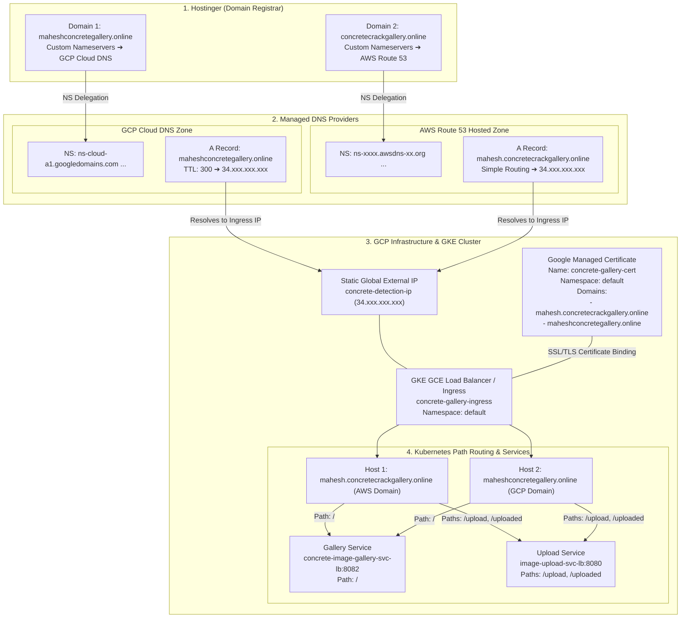

# Technical Architecture & Deployment Guide: Multi-Domain Routing with Hostinger, AWS Route 53 & GCP GKE

---

## 1. Executive Summary & Architectural Overview

This document provides a comprehensive technical breakdown of how **two distinct domain names**, registered via **Hostinger** and managed across **GCP Cloud DNS** and **AWS Route 53**, route to a **single Static Ingress IP** on Google Kubernetes Engine (GKE), secured by a single **Google-Managed SSL Certificate** (`concrete-gallery-cert`) covering both domains as Subject Alternative Names (SAN).

---

## 2. End-to-End Multi-Domain Architecture Diagram

### A. High-Level Flowchart (Mermaid)



---

### B. ASCII Infrastructure Flow Diagram

```
+-----------------------------------------------------------------------------------+
|                            1. HOSTINGER (REGISTRAR)                               |
|                                                                                   |
|  [ maheshconcretegallery.online ]              [ concretecrackgallery.online ]    |
|   Nameservers: ns-cloud-a1.googledomains...     Nameservers: ns-xxxx.awsdns...    |
+--------------------------+----------------------------------+---------------------+
                           |                                  |
                           v                                  v
+-----------------------------------------------------------------------------------+
|                            2. MANAGED DNS PROVIDERS                               |
|                                                                                   |
|   GCP Cloud DNS (Zone: concrete-zone-1)        AWS Route 53 (Hosted Zone)         |
|   A Record: maheshconcretegallery.online       A Record: mahesh.concretecrack...  |
|   Target IP: 34.xxx.xxx.xxx                    Target IP: 34.xxx.xxx.xxx          |
+--------------------------+----------------------------------+---------------------+
                           |                                  |
                           +------------------+---------------+
                                              |
                                              v
+-----------------------------------------------------------------------------------+
|                        3. GCP GKE INGRESS & SSL CERTIFICATE                       |
|                                                                                   |
|                      Static External IP: concrete-detection-ip                    |
|                                 (34.xxx.xxx.xxx)                                  |
|                                         |                                         |
|                 +-----------------------+-----------------------+                 |
|                 |  Google-Managed Certificate                   |                 |
|                 |  Name: concrete-gallery-cert                  |                 |
|                 |  Namespace: default                           |                 |
|                 |  SAN Domains:                                 |                 |
|                 |    1. mahesh.concretecrackgallery.online      |                 |
|                 |    2. maheshconcretegallery.online            |                 |
|                 +-----------------------+-----------------------+                 |
|                                         |                                         |
|                           GKE Ingress (GCE Load Balancer)                         |
+-----------------------------------------+-----------------------------------------+
                                          |
                                          v
+-----------------------------------------------------------------------------------+
|                     4. KUBERNETES BACKEND SERVICE ROUTING                         |
|                                                                                   |
|   1. AWS Host: mahesh.concretecrackgallery.online                                 |
|   ├── /         ──► Gallery Svc (:8082)                                           |
|   ├── /upload   ──► Upload Svc (:8080)                                            |
|   └── /uploaded ──► Upload Svc (:8080)                                            |
|                                                                                   |
|   2. GCP Host: maheshconcretegallery.online                                       |
|   ├── /         ──► Gallery Svc (:8082)                                           |
|   ├── /upload   ──► Upload Svc (:8080)                                            |
|   └── /uploaded ──► Upload Svc (:8080)                                            |
+-----------------------------------------------------------------------------------+
```

---

## 3. Kubernetes Manifest Specifications

### A. ManagedCertificate Manifest (`managedcertificate.yaml`)
```yaml
apiVersion: networking.gke.io/v1
kind: ManagedCertificate
metadata:
  name: concrete-gallery-cert
  namespace: default
spec:
  domains:
    - mahesh.concretecrackgallery.online
    - maheshconcretegallery.online
```

### B. Ingress Manifest (`ingress.yaml`)
```yaml
apiVersion: networking.k8s.io/v1
kind: Ingress
metadata:
  name: concrete-gallery-ingress
  namespace: default
  annotations:
    kubernetes.io/ingress.class: "gce"
    networking.gke.io/managed-certificates: "concrete-gallery-cert"
    kubernetes.io/ingress.global-static-ip-name: "concrete-detection-ip"
spec:
  ingressClassName: "gce"
  rules:
    # 1. AWS Route 53 Domain
    - host: mahesh.concretecrackgallery.online
      http:
        paths:
          - path: /
            pathType: Prefix
            backend:
              service:
                name: concrete-image-gallery-svc-lb
                port:
                  number: 8082
          - path: /upload
            pathType: Prefix
            backend:
              service:
                name: image-upload-svc-lb
                port:
                  number: 8080
          - path: /uploaded
            pathType: Prefix
            backend:
              service:
                name: image-upload-svc-lb
                port:
                  number: 8080

    # 2. GCP Domain
    - host: maheshconcretegallery.online
      http:
        paths:
          - path: /
            pathType: Prefix
            backend:
              service:
                name: concrete-image-gallery-svc-lb
                port:
                  number: 8082
          - path: /upload
            pathType: Prefix
            backend:
              service:
                name: image-upload-svc-lb
                port:
                  number: 8080
          - path: /uploaded
            pathType: Prefix
            backend:
              service:
                name: image-upload-svc-lb
                port:
                  number: 8080
```

---

## 4. Verification & Validation Checklist

1. **Verify Git Branch**:
   ```bash
   git branch
   # Should output: * feature/aws-domain-multi-domain-ingress
   ```

2. **Verify Helm Chart Template Rendering**:
   ```bash
   helm template master-chart ./masterChart -f ./masterChart/values-gcp.yaml
   ```

3. **Verify Ingress & ManagedCertificate Status in GKE Cluster**:
   ```bash
   kubectl get ingress concrete-gallery-ingress -n default
   kubectl describe managedcertificate concrete-gallery-cert -n default
   ```

4. **Verify DNS Resolution for Both Domains**:
   ```bash
   nslookup mahesh.concretecrackgallery.online
   nslookup maheshconcretegallery.online
   ```
   *Both commands resolve to the exact same Ingress IP (`34.xxx.xxx.xxx`).*

5. **Verify Endpoint Accessibility over HTTPS**:
   - `https://mahesh.concretecrackgallery.online/`
   - `https://maheshconcretegallery.online/`
   - `https://mahesh.concretecrackgallery.online/upload`
   - `https://maheshconcretegallery.online/upload`
